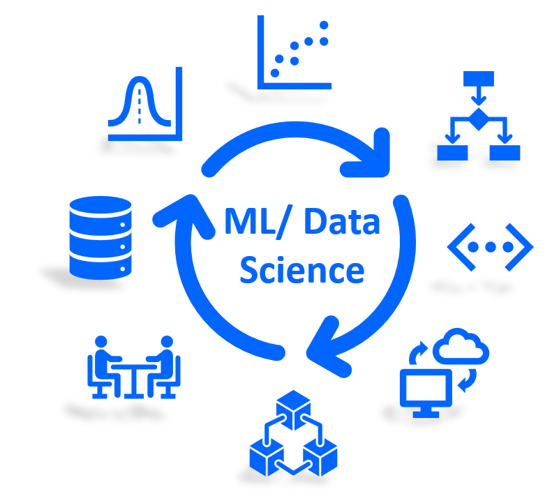
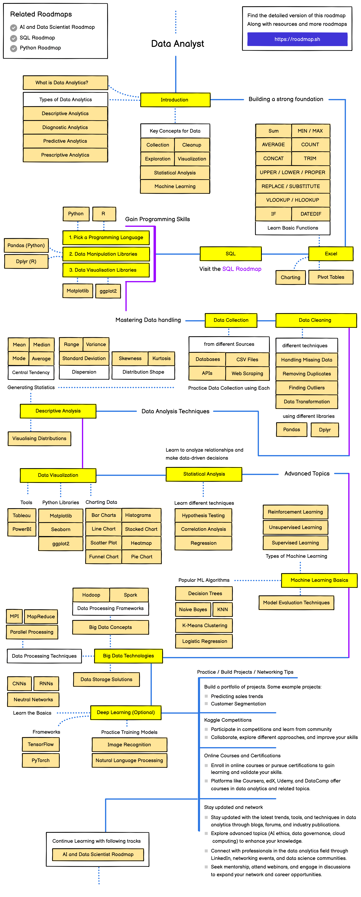

#Learn Python the Harder Way 

Topics to be Covered:

```
Core Python
OOPS
Numpy 
Pandas
Data Analytics Tools
FastApi

```




```
myenv\Scripts\activate

deactivate --- To Deactivate the Enironment 
```




Requirements 
- Python 3.7 or higher
- FastAPI
- Matplotlib
- Numpy
- Pandas
- Scikit-learn
```
Things need to complete 

Theory
Excel
Python -- pandas, matplotlib, statitics
Data Analytics and Visualization  -- PowerBI
Statistical Analytics
Popular Big Data Analytics
Machine Learning Algos
```